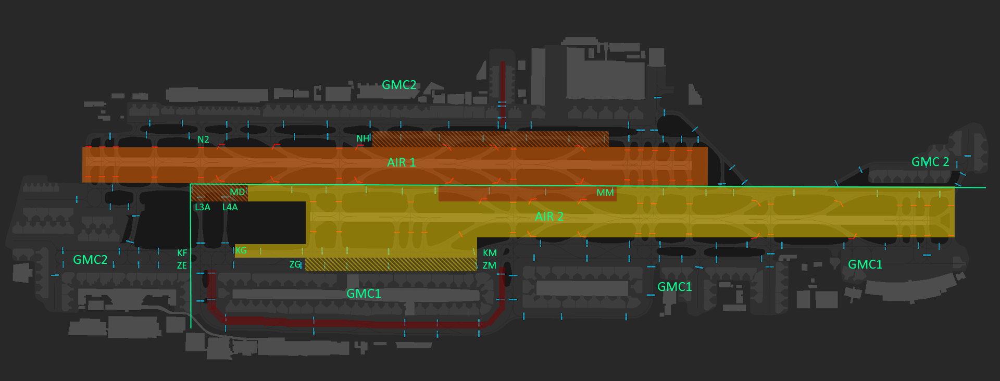

# 2. Areas of Responsibility
## 2.1 Use of Diagrams
Areas indicated in a solid colour are the sole responsibility of the respective AIR controller. GMC shall expect traffic to only be handed off once at the boundary of these areas. Transfer of control shall be initiated by GMC before aircraft reach the boundary of these areas.

Areas indicated in a cross-hatched colour are areas of shared responsibility. Here, transfer of control may only be initiated when required between controllers, except as provided in 4.3.1 to facilitate a non-stop taxi.

Uncoloured areas are the responsibility of the respective GMC controller as indicated by the green boundary line between GMC 1 and GMC 2.

!!! important
    To avoid conflicts at taxiway intersections, aircraft shall only be cleared to the boundary of the controller's specific area of responsibility as described in section 4 unless the procedure specifically states otherwise (traffic taxiing on M to be cleared by GMC 1 to M13A before being handed off to AIR, for example).

## 2.2 Runway 30L/30R
<figure markdown>

</figure>

## 2.3 Runway 12L/12R
<figure markdown>

</figure>
