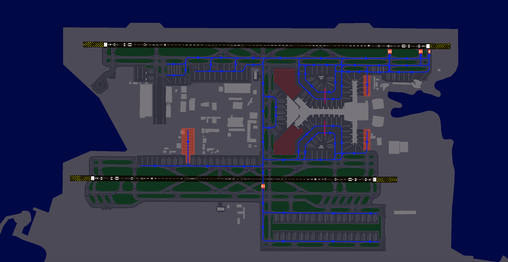

# 6. Appendix - Taxi Diagrams
## 6.1 Use of Diagrams
Blue lines indicate departure taxi routes. Yellow lines indicate arrival taxi routes.

Commonly used intermediate holding points are shown in white. Runway holding points are shown in red.

Taxiways with a red background are not code F (A380/B747-8) compatible.

## 6.2 Runway 16L
### 6.2.1 Departure

### 6.2.2 Arrivals

## 6.3 Runway 16R
### 6.3.1 Departure

### 6.3.2 Arrivals

## 6.4 Runway 34L
### 6.4.1 Departure
<figure markdown>

</figure>

### 6.4.2 Arrivals

## 6.5 Runway 34R
### 6.5.1 Departure
<figure markdown>

</figure>

### 6.5.2 Arrivals

