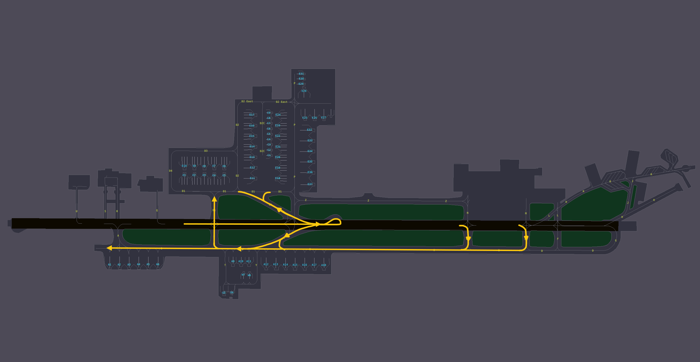
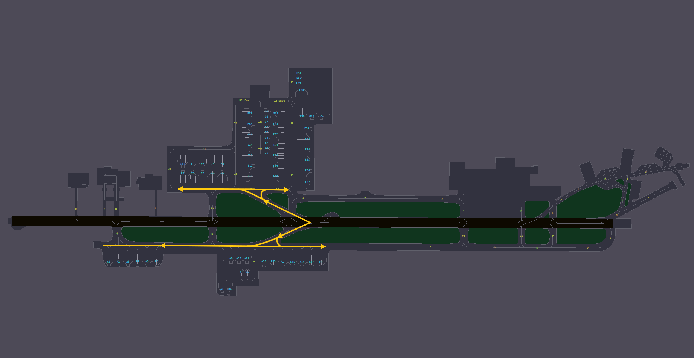

# 6. Appendix - Taxi Diagrams
## 6.1 Use of Diagrams
Blue lines indicate departure taxi routes. Yellow lines indicate arrival taxi routes.

Commonly used hold short taxiways are shown in white. Runway holding points are shown in red.

## 6.2 Runway 15 configuration
### 6.2.1 Departures
<figure markdown>

</figure>

### 6.2.2 Arrivals
<figure markdown>

</figure>

## 6.3 Runway 33 configuration
### 6.3.1 Departures
<figure markdown>

</figure>

### 6.3.2 Arrivals
<figure markdown>

</figure>
