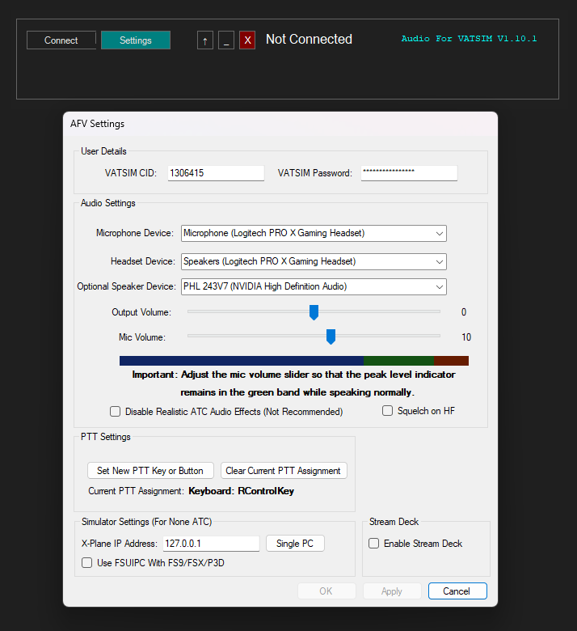
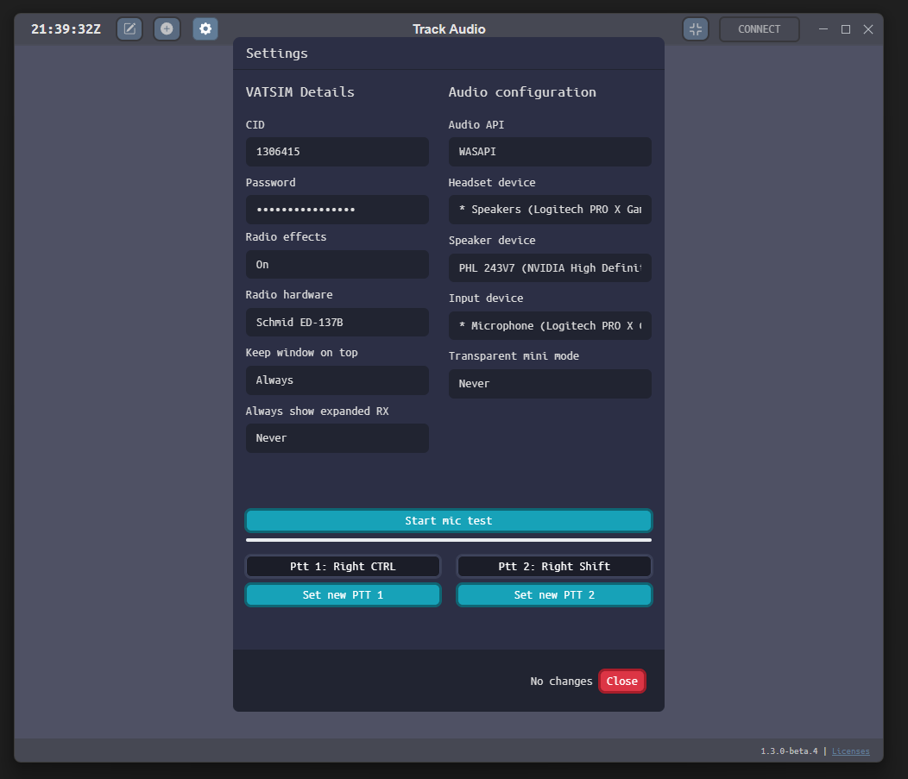

# Audio Clients
## Available Clients
There are two audio clients available for use on VATSIM:  

- **Audio for VATSIM**  
      - [Download Audio for VATSIM](https://audio.vatsim.net/assets/files/audio-for-vatsim-12376d020a19027dcad44bb0be1a2ca7.msi)  

- **Track Audio**  
      - [Download Track Audio](https://github.com/pierr3/TrackAudio/releases/tag/1.3.0-beta.4)  

---

## Setting Up the Audio Client

1. **Install the chosen client** and open the settings menu.
2. **Input your credentials and configure audio devices**:
      - Enter your VATSIM CID and password.
      - Set your input (microphone) and output (headset/speakers) devices.
      - **Audio for VATSIM**:
          - Adjust the microphone volume to stay within the green band for optimal audio clarity.
      - **Track Audio**:
          - The microphone volume is set automatically. Radio hardware selection is user preference, with Schmid ED-137B recommended.
3. **Set a Push-to-Talk (PTT) key**:
      - Choose a key that won't conflict with other activities.
      - **Track Audio only**: Disconnect any joysticks, as they may interfere with PTT functionality.
4. Press **OK** to save your settings.  
      - **Important**: Settings changes can only be made when disconnected from the client.

<figure markdown="span">
  
  <figcaption>Audio for VATSIM: Settings</figcaption>
</figure>

<figure markdown="span">
  
  <figcaption>Track Audio: Settings</figcaption>
</figure>

---

## Using the Audio Client

### Observer Mode

- **Audio for VATSIM**:
    - Ensure you are connected to VATSIM via EuroScope.
    - Click **Connect** in the Audio for VATSIM client.
    - Your observer callsign (e.g., `JK_OBS`) and frequency `199.998` will appear.
    - To listen to a frequency:
           - Click the **+** button and type the position callsign (e.g., `DOH_R1_APP`).
           - Press **RX** on the frequency you added to start listening.

<figure markdown="span">
  
  <figcaption>Audio for VATSIM Client: Connecting Online</figcaption>
</figure>

<figure markdown="span">
  
  <figcaption>Audio for VATSIM Client: Adding a Position</figcaption>
</figure>

<figure markdown="span">
  
  <figcaption>Audio for VATSIM Client: Receiving on a Frequency</figcaption>
</figure>

- **Track Audio**:
    - Ensure you are connected to VATSIM via EuroScope.
    - Click **Connect** in the Track Audio client.
    - Your observer callsign (e.g., `JK_OBS`) will display at the top.
    - To listen to a frequency:
           - Enter the position callsign under **Add a Station** and press **Add**.
           - Press **RX** on the frequency to start listening.

<figure markdown="span">
  
  <figcaption>Track Audio Client: Connecting Online</figcaption>
</figure>

<figure markdown="span">
  
  <figcaption>Track Audio Client: Adding a Position</figcaption>
</figure>

<figure markdown="span">
  
  <figcaption>Track Audio Client: Receiving on a Frequency</figcaption>
</figure>

---

### Controller Mode

- Log in to EuroScope and connect to your controlling position.
- Open the audio client, which will automatically:
      - Detect your position.
      - Add relevant frequencies to your session.
- **Transmit and Receive**:
      - Press **TX** to transmit and **RX** to receive on a frequency.
- **Cross-Coupling Frequencies**:
      - **Audio for VATSIM**: Use the **XC** button.
      - **Track Audio**: Use the **XCA** button.
      - Cross-coupling ensures pilots in different areas of your airspace can hear each other, reducing blocked transmissions.
- **Audio Output Control**:
      - **Audio for VATSIM**: Press the **speaker icon** to transfer output from headset to speakers.
      - **Track Audio**: Press **SPK** for the same functionality.
- **Additional Features (Track Audio Only)**:
      - **RX/TX on UNICOM and GUARD** frequencies. However, only TX on those frequencies when you have the intention to TX on them!

---
