# EuroScope
!!! info
    If you’re seeking a video tutorial on setting up Euroscope, installing our sector files, and getting ready to observe, check out our video [here!](https://www.youtube.com/watch?v=ycCieiy0ufc)

## What is EuroScope?  
EuroScope is a software application that allows members to provide air traffic control on the VATSIM network. It is the primary ATC client used by controllers worldwide.

### How to Download Euroscope

- **Download EuroScope**  
     - Visit the official EuroScope website: [https://www.euroscope.hu/](https://www.euroscope.hu/).  
     - Download the latest **public release version 3.2.9**.  

- **Optional: Beta Version**  
     - You may install the latest beta version at your discretion. Be aware that some beta builds may contain bugs that could affect controlling. Follow the recommendations in this guide to determine which beta version to use.  

## Setting up Euroscope
### Initial Setup

- **Initial Setup (First Launch)**  
     - Open EuroScope for the first time without loading any profiles.  
     - Navigate to **Other Set** (next to the Zulu clock).  
     - Untick the following options:  
         - **Auto load last profile on startup**  
         - **Auto save profile on exit**  
     - This ensures you can select a profile each time you start EuroScope instead of defaulting to the Hungary profile. You may now close Euroscope and proceed to the Sector File Installation.

<figure markdown="span">
  
  <figcaption>Euroscope: Disabling Automatic Profile Loading & Saving</figcaption>
</figure>

### Sector File Installation  
- **Download the Sector Files**  
     - Sector files for the Arabian vACC are hosted on the AeroNav Association website ([files.aero-nav.com](https://files.aero-nav.com)):  
       - **OMAE** - U.A.E ([files.aero-nav.com/OMAE](https://files.aero-nav.com/OMAE))  
       - **OTDF** - Doha ([files.aero-nav.com/OTDF](https://files.aero-nav.com/OTDF))  
       - **OOMM** - Muscat ([files.aero-nav.com/OOMM](https://files.aero-nav.com/OOMM))  

- **Install the Sector Files**  
     - For first-time installation, download the **Install-Package**.  
     - Extract the files to a dedicated sector file folder (e.g., `Documents/Euroscope/Sector Files`).  
     - Create a new folder inside that directory with the FIR code (e.g., `OMAE`).  

<figure markdown="span">
  
  <figcaption>Euroscope: Storing your Sector Files</figcaption>
</figure>

- **Explore the Extracted Files**  
     - **Profile Files (.prf):** Found for each aerodrome, terminal, and enroute sector.  
     - **Alias.txt File:** Located in `FIR CODE/Alias`, containing shortcut commands for text communication.  
     - **vATIS Profiles:** Located in `FIR CODE/Plugins/vATIS` for the specific FIR.  

### Using the Sector Files  
- **Load a Profile**  
     - The sector file is "plug and play." Once extracted, open the desired profile to start observing.  
     - Profiles are organized by position:  
         - **Aerodrome Profiles:** For Delivery, Ground, and Tower controllers. Includes AIR Radar and GMC Surface Movement Guidance and Control (SMGCS) displays.  
         - **Terminal Profiles:** For Departure and Arrival controllers. Includes radar views for the terminal area and SMGCS displays for relevant aerodromes.  
         - **Area Profiles:** For enroute controllers. Covers the entire FIR and SMGCS displays for all aerodromes.  
         - **Military Profiles:** For military aerodromes in the FIR.  

- **Switch Between Views**  
     - Upon loading a profile, you will see the **AIR Aerodrome View** centered on the aerodrome you selected.  
     - To open the **SMGCS Ground Display**, press ++f1+2++. This view shows the airport’s ground layout.  
     - To return to the **AIR Aerodrome View**, press ++f1+1++.

<figure markdown="span">
  
  <figcaption>Euroscope: AIR Aerodrome View F1+1</figcaption>
</figure>

<figure markdown="span">
  
  <figcaption>Euroscope: SMGCS Ground View F1+2</figcaption>
</figure>

You’re now ready to start using EuroScope for observing or controlling on the VATSIM network. For further assistance, ask your questions in the Arabian vACC Discord in the Training-Text channel or the mentoring/instructor team.

## Observing on the VATSIM Network with EuroScope
Before starting, ensure you have installed and set up an **Audio for VATSIM** client. Refer to the **Audio Section** in the **Controller Software Setup section** for details.

### Connecting to the Network  

- **Load a Profile**  
     - Open the EuroScope profile for the position you want to observe (e.g., Aerodrome Dubai, Aerodrome Abu Dhabi, or Aerodrome Doha).  

- **Connect to the Network**  
     - Click the **Connect** button in the top-left corner of the screen.  
     - Fill out the connection dialog:  
         - Replace `<INITIALS>` with your own initials (e.g., "CK" for Chriss Klosowski). Keep the **_OBS** suffix to indicate observer status.  
         - Enter your **Real Name** as per the VATSIM Code of Conduct A4(b).  
         - Input your **VATSIM Certificate** and **Password**.  
         - Set **Facility & Rating** to **Observer**.  
         - Select **Server** as **Automatic**.  
     - Click the **Connect** button at the bottom-left of the dialog.  

<figure markdown="span">
  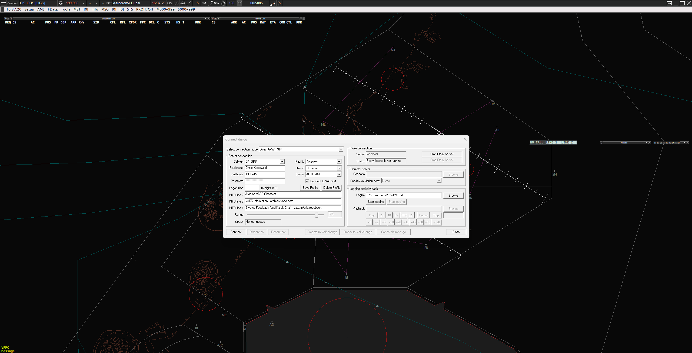
  <figcaption>Euroscope: Connecting as an Observer</figcaption>
</figure>

- **Post-Connection**  
       - Once connected, the connection dialog will disappear, and the **Voice Communication Setup** window will open. Close this window.  
       - If there is traffic in the area, aircraft will begin populating on your screen. You are now connected!
       - If no traffic is visible despite activity in the area you're observing, type `.vis <ICAO>` (e.g., `.vis OMDB`) in the command line at the bottom and press Enter. This will center your visibility point on the selected aerodrome.
       - To populate the different lists, select the active runways at the aerodrome you are observing using the runway selection dialog.  
       - If the full taxiways, intermediate holding points, runway holding points, or stands are not visible (as intended), follow these steps in order to see them. You may need to zoom in to "activate" their display:  
            - Open the grey Ground Radar Plugin menu.  
            - Navigate to **FUNCTIONS -> Maps**.  
            - Select the aerodrome you are observing.  
            - Change the items you want from **AUTO** to **ON**.  

<figure markdown="span">
  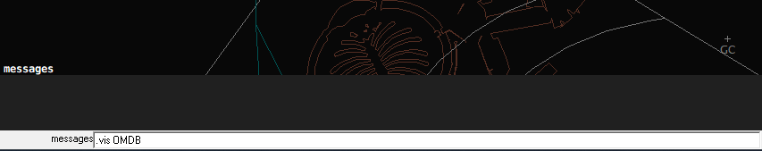
  <figcaption>Euroscope: Setting a Visibility Point</figcaption>
</figure>

<figure markdown="span">
  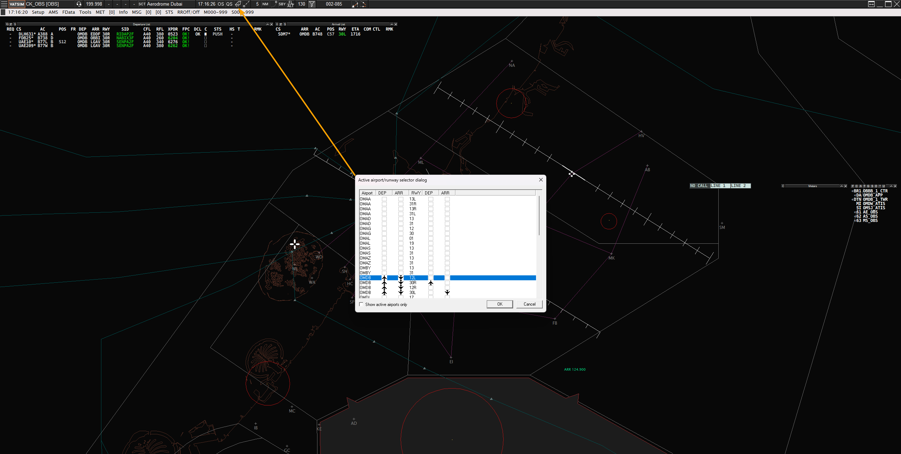
  <figcaption>Euroscope: Runway Selection Dialog</figcaption>
</figure>

<figure markdown="span">
  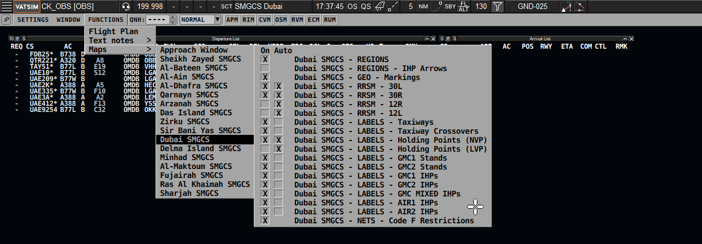
  <figcaption>Ground Radar Plugin: Turning on Taxiways, Intermediate holding points, runway holding points, and stands</figcaption>
</figure>

### Listening to Active Frequencies  

To listen to an active position, you must connect to the Audio for VATSIM service using either **Audio for VATSIM** or **Track Audio**.  

#### Using Audio for VATSIM  
- Open **Audio for VATSIM** and click **Connect**.  
- Your active callsign (e.g., **CK_OBS**) will appear above the **+** button with a frequency of **199.998**.  
- To select a frequency:  
      - Click the **+** button below your active callsign.  
      - Enter the callsign of the station you want to listen to (e.g., **OMDB_1_GND**) and press **Enter**.  
      - The frequency will appear below your active callsign.  
- Press the **RX** button to start listening to the selected frequency.  
-  When a transmission occurs:  
      - The **RX** button will turn orange.  
      - The last transmitting callsign will display at the top of your window.  
- To add another frequency, click the **+** button and repeat the process.

<figure markdown="span">
  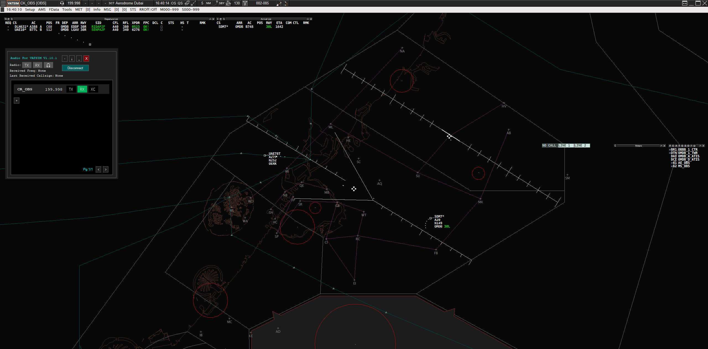
  <figcaption>Audio for VATSIM Client: Connecting Online</figcaption>
</figure>

<figure markdown="span">
  
  <figcaption>Audio for VATSIM Client: Adding a Position</figcaption>
</figure>

<figure markdown="span">
  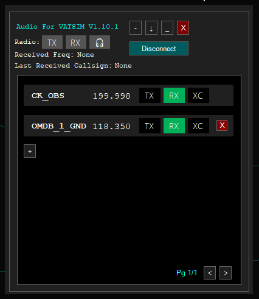
  <figcaption>Audio for VATSIM Client: Receiving on a Frequency</figcaption>
</figure>

#### Using Track Audio  
- Open **Track Audio** and click **Connect**.  
- Your active callsign (e.g., **CK_OBS**) will display at the top of the window.  
- To listen to a frequency:  
       - Under **Add a Station**, enter the callsign of the station you want to monitor (e.g., **OMDB_1_GND**) and click **Add**.  
       - The frequency will appear in the list.  
       - Press the **RX** button to begin listening.  
- When a transmission occurs:  
       - The **RX** button will turn orange.  
       - The last transmitting callsign will display at the top of the window.  
- To monitor another frequency, click the **+** button in the top-left corner and repeat the process.

<figure markdown="span">
  
  <figcaption>Track Audio Client: Connecting Online</figcaption>
</figure>

<figure markdown="span">
  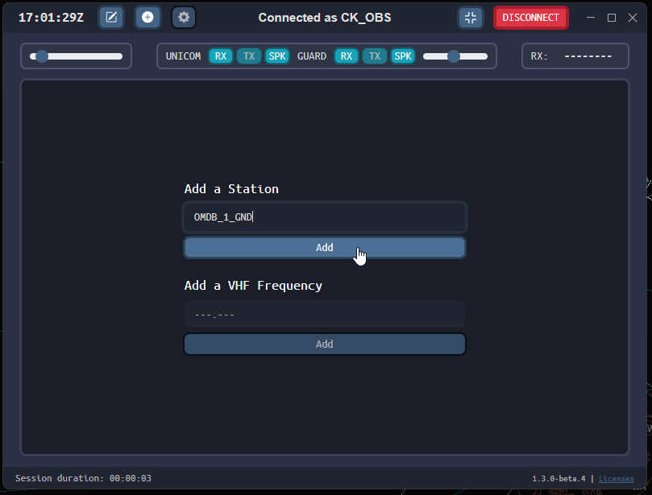
  <figcaption>Track Audio Client: Adding a Position</figcaption>
</figure>

<figure markdown="span">
  
  <figcaption>Track Audio Client: Receiving on a Frequency</figcaption>
</figure>

!!! important
    - Ensure the station you wish to monitor is active and online.  
    - If you do not hear transmissions, it may mean there are no active transmissions on the frequency at that time.  

You’re now set up to observe and listen to live ATC on the VATSIM network!

## Euroscope Functionalities
Comprehensive functionality and documentation are available at [EuroScope Documentation](https://www.euroscope.hu/wp/documentation-about-euroscope/).  

### Sector Menu
In this menu, you'll find options to modify the core EuroScope sector file and displays. Clicking **OPEN** allows you to choose from a variety of pre-configured ASR Displays located in the **FIR CODE/ASR** folder. **Load Sector File** will reload the .sct file, which contains all navigation and airspace data for the FIR.

<figure markdown="span">
  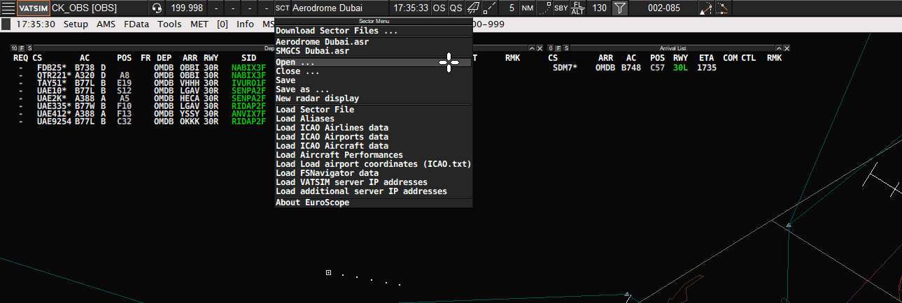
  <figcaption>Euroscope: Sector Menu</figcaption>
</figure>

### Other Settings Menu
In this menu, you'll find options to save the profile (.prf), save your settings, and access various configuration options. 

- **General Settings: Page 1**: Here, you can adjust options like the display, tags, and miscellaneous settings.  
- **General Settings: Page 2**: This allows you to edit the ASR display fast keys (e.g., ++f1+1++/++2++/++3++/++4++/++5++/++6++/++7++/++8++/++9++).  
- **Display Settings**: Choose what to display on the screen and control the display rotation. However, if everything is drawn via TopSky Maps, you can only adjust the rotation, not the content displayed.  
- **Symbology Settings**: Customize the colors seen on the screen, though note that some symbology is controlled by plugins, not EuroScope.  
- **Plugins Dialog**: View the currently active plugins.  
- **Active Airport/Runway Selection**: Select the active runway(s) for departure and arrival. You can also open this menu by clicking the Runway icon next to the Quick Set menu.  

<figure markdown="span">
  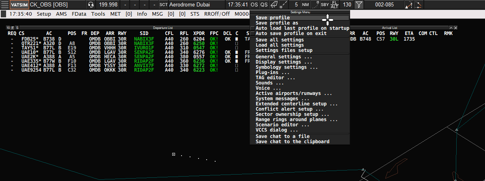
  <figcaption>Euroscope: Other Settings Menu</figcaption>
</figure>

### Quick Setings Menu
In this menu, you can choose which lists are displayed on your screen and customize their setup.  

<figure markdown="span">
  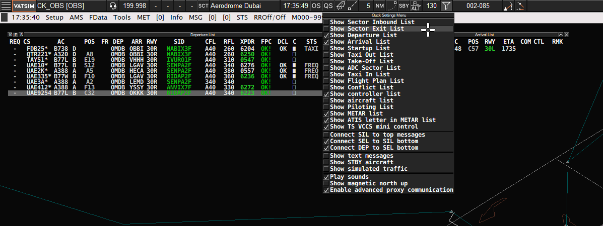
  <figcaption>Euroscope: Quick Settings Menu</figcaption>
</figure>

### Runway Selection Dialog
Select the active runway(s) for departure and arrival. You can also open this menu by clicking the Runway icon next to the Quick Set menu.  

<figure markdown="span">
  
  <figcaption>Euroscope: Runway Selection Dialog</figcaption>
</figure>

### Window Positioning
Right-clicking the maximize button lets you adjust the window positioning of EuroScope.  

<figure markdown="span">
  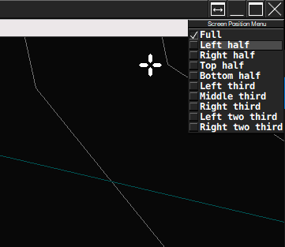
  <figcaption>Euroscope: Window Positioning</figcaption>
</figure>

### Keyboard Shortcuts
<table><thead>
  <tr>
    <th>Keys</th>
    <th>Parameters</th>
    <th>Action</th>
  </tr></thead>
<tbody>
  <tr>
    <td>F2</td>
    <td>+ 4 letter ICAO Code(s)</td>
    <td>Add/Remove METARs</td>
  </tr>
  <tr>
    <td>F3</td>
    <td>+ Click Aircraft Tag OR Hover Aircraft Tag</td>
    <td>Track Aircraft/Accept Handoff</td>
  </tr>
  <tr>
    <td>F4</td>
    <td>+ Click Aircraft Tag OR Hover Aircraft Tag</td>
    <td>Drop Aircraft/Reject Handoff/Initiate Handoff</td>
  </tr>
  <tr>
    <td>F5</td>
    <td>+ Altitude (hundreds) + Click Aircraft Tag</td>
    <td>Change Final Altitude (Flight plan altitude)</td>
  </tr>
  <tr>
    <td>F6</td>
    <td></td>
    <td>Show Flight Strip for current aircraft</td>
  </tr>
  <tr>
    <td>F7</td>
    <td></td>
    <td>Cycle through open Radar Views</td>
  </tr>
  <tr>
    <td>F8</td>
    <td>+ Altitude (hundreds) + Click Aircraft Tag</td>
    <td>Change Temporary Assigned Altitude</td>
  </tr>
  <tr>
    <td>F9</td>
    <td>+ V/R/T + Click Aircraft Tag</td>
    <td>Set the Communication Type (Voice/Receive/Text)</td>
  </tr>
  <tr>
    <td>F11</td>
    <td></td>
    <td>Zoom In Radar</td>
  </tr>
  <tr>
    <td>F12</td>
    <td></td>
    <td>Zoom Out Radar</td>
  </tr>
</tbody></table>

<table><thead>
  <tr>
    <th>Keys</th>
    <th>Command</th>
    <th>Parameters</th>
    <th>Action</th>
  </tr></thead>
<tbody>
  <tr>
    <td>F1 + A</td>
    <td>.am</td>
    <td>+ Click Aircraft Tag</td>
    <td>Amend Flight Plan</td>
  </tr>
  <tr>
    <td>F1 + C</td>
    <td>.chat</td>
    <td>+ Click Aircraft Tag</td>
    <td>Open Chat Window</td>
  </tr>
  <tr>
    <td>F1 + D</td>
    <td>.distance</td>
    <td>+ Click Aircraft Tag + Click Aircraft Tag/Point</td>
    <td>Displays a continually updated distance between aircraft and/or point</td>
  </tr>
  <tr>
    <td>F1 + F</td>
    <td>.find</td>
    <td>+ Type any Aircraft/Fix</td>
    <td>Display line from center of screen to that point</td>
  </tr>
  <tr>
    <td>F1 + P</td>
    <td>.point</td>
    <td>+ Controller ID + Click Aircraft Tag</td>
    <td>Highlights the specified aircraft on the specified controllers screen</td>
  </tr>
  <tr>
    <td>F1 + S</td>
    <td>.sep</td>
    <td>+ Click Aircraft Tag + Click Aircraft Tag</td>
    <td>Displays continually updated prediction of closest point between aircraft</td>
  </tr>
  <tr>
    <td>F1 + 0</td>
    <td></td>
    <td></td>
    <td>Close the current ASR view</td>
  </tr>
  <tr>
    <td>F1 + 1 to 9</td>
    <td></td>
    <td></td>
    <td>Opens the pre-defined ASR views defined in General Settings, Page 2</td>
  </tr>
</tbody></table>

## Frequently Asked Questions
??? Question "I don't see any aircraft"
     EuroScope cannot automatically determine the aerodrome you want to observe. Set a visibility center for your desired airfield by typing `.vis <ICAO>` (e.g., `.vis OMDB`).  

??? Question "I don't see any data in the lists"
     When observing, EuroScope cannot identify your area of interest. You must manually select the active runways using the runway selection dialog.  

??? Question "I don't see tags for aircraft on the ground"
     This is an intended feature. Tags will appear once an aircraft's ground status is set to "ON FREQ" and it is squawking its code. If you wish to view all tags (though unrealistic), go to the Ground Radar Plugin menu (grey bar), click on **Settings -> Labels**, and untick **NoState**.  

??? Question "I accidently closed my METAR, how do I get it back?"
     type in .qd or press ++f2++ followed by the ICAO of the airport