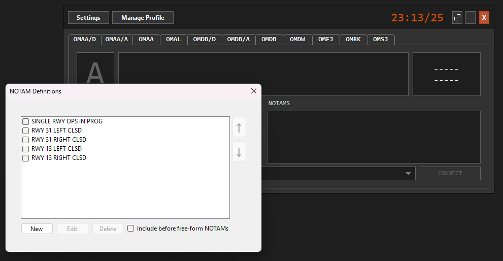

# vATIS
## What is vATIS?
vATIS is a software tool that enables controllers to create and broadcast multiple Automatic Terminal Information Service (ATIS) messages on the VATSIM network. It is an essential tool for air traffic controllers to provide pilots with crucial airport and weather information.

### How to Download vATIS
1. Visit the vATIS documentation and download page at [this link](https://hub.vatis.app/download/windows).
2. Follow the instructions provided on the website to download and install the software.

## Setting Up vATIS
### Locate the vACC Profiles
- The pre-configured profiles for Oman, Qatar, and the U.A.E are available in the following directory of the sector file:  
    `FIR CODE/Plugins/vATIS`.

!!! warning
    Controllers are responsible for updating their vATIS profiles as directed by the ATC Operations Department. Be sure to update your profiles following each announcement from the ATC Operations team!  

<figure markdown>

</figure>
<figure markdown>
  <figcaption>vATIS: Profiles Location</figcaption>
</figure>

### Load a Profile
- Open vATIS and navigate to the settings or profiles menu.
- Import the profile corresponding to your assigned FIR from the directory mentioned above.

<figure markdown>

</figure>
<figure markdown>
  <figcaption>vATIS: Profile Import</figcaption>
</figure>

### Configuring your Credentials in vATIS
- Open the settings dialog and input your:
    - Your Name (Compliant with the VATSIM Code of Conduct, Section A4(b))
    - Your VATSIM CID
    - Your VATSIM Password
    - Your Network Rating
    - Network Server: Automatic

<figure markdown>

</figure>
<figure markdown>
  <figcaption>vATIS: Settings Setup</figcaption>
</figure>

## Configuring and Managing ATIS Connections in vATIS
### Simultaneous ATIS Connections  
- **Up to 4 ATIS connections** can be opened at once.  
- **Aerodrome Controllers**: Open a split Departure (/D) and Arrival (/A) ATIS if available or a single ATIS for their aerodrome.  
- **Terminal and Above**: Open all ATIS facilities within their airspace.  

### Identifying ATIS Connections  
- ATIS connections are listed by ICAO code at the top.  
  - **/D** = Departure ATIS.  
  - **/A** = Arrival ATIS.  
  - **ICAO code only** = Combined ATIS.
  
<figure markdown>

</figure>
<figure markdown>
  <figcaption>vATIS: Available Aerodromes</figcaption>
</figure>

### Configuring an ATIS  
- **Select the Airport Configuration**  
     - Use the dropdown below the ICAO code to choose the configuration for the airport.  

<figure markdown>

</figure>
<figure markdown>
  <figcaption>vATIS: Airport Configuration Dropdown</figcaption>
</figure>

- **Set Airport Conditions and NOTAMs**  
     - Click directly on the respective text to select conditions or NOTAMs.  
     - Tick the appropriate boxes to confirm the selection, then exit the window.

<figure markdown>

</figure>
<figure markdown>
  <figcaption>vATIS: Airport Conditions Window</figcaption>
</figure>

<figure markdown>

</figure>
<figure markdown>
  <figcaption>vATIS: NOTAMS Window</figcaption>
</figure>

- **Final Setup**
     - Once all selections are complete, simply press **Connect** to connect the ATIS!  

<figure markdown>

</figure>
<figure markdown>
  <figcaption>vATIS: Active Connection</figcaption>
</figure>

### Applying Changes  
- **Before Connecting**: Selected conditions and NOTAMs are added automatically before the ATIS is connected.
- **After Connecting**: To apply updated conditions and NOTAMs after making changes in their respective windows, change the ATIS identifier:  
    - Left-click the current identifier in the top left (above "ARPT COND").  
    - Changes will be added to the ATIS information after updating the identifier.
