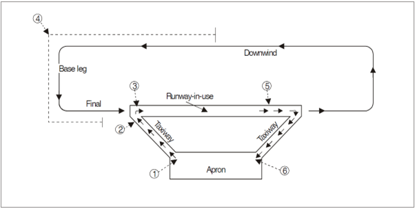
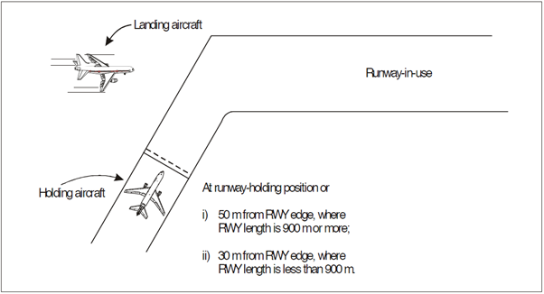
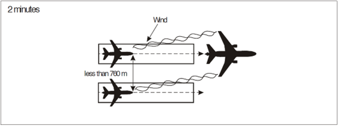
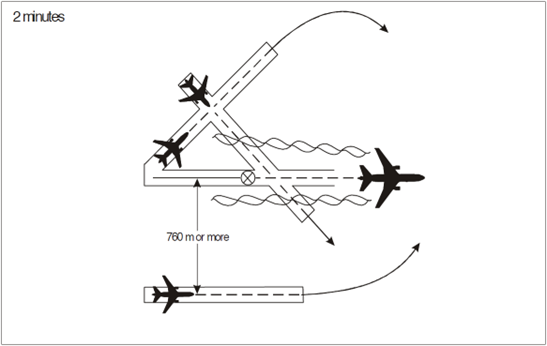
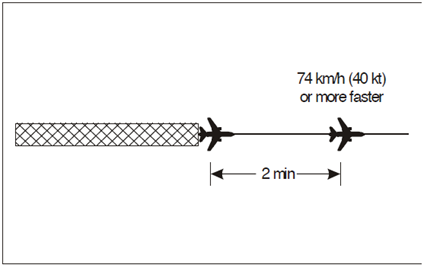

# 6. Aerodrome Control Service
## 6.1 General provisions
Aerodrome control towers issue information and clearances to aircraft under their control to achieve a safe, orderly, and expeditious flow of air traffic at and in the vicinity of an aerodrome. The main objective of aerodrome controllers is to prevent collisions between:

- Aircraft flying within the designated area of responsibility of the control tower, including the aerodrome traffic circuit;
- Aircraft operating on the manoeuvring area;
- Aircraft landing and taking off;
- Aircraft and vehicles operating on the manoeuvring area;
- Aircraft of the manoeuvring area obstructions on that area;

Aerodrome controllers should maintain a continuous watch on all flight operations on and in the vicinity of the aerodrome. Watch shall be maintained by visual means which may be augmented by ATS surveillance under low visibility conditions.

The function of an aerodrome controller is normally performed by different positions:

- Aerodrome controller, responsible for operations on the runway and aircraft flying within the area of responsibility of the control tower (control zone);
- Ground controller, responsible for traffic on the manoeuvring area with the exception of runways;
- Clearance delivery position, normally responsible for the delivery of IFR clearances and, where necessary the adjustment of start-up times.

Where parallel or near-parallel runways are used for simultaneous operations, individual aerodrome controllers should be responsible for operations on each of the runways.

## 6.2 Control of aerodrome traffic
### 6.2.1 Designated positions of aircraft in the aerodrome traffic and taxi circuits
The following positions in the aerodrome traffic and taxi circuits are where aircraft receive clearance from the aerodrome control tower (Figure 6-1). Aircraft should be watched closely as they approach these positions so that proper clearances may be issues without delay. Wherever possible, the controller should initiate the radio call without having to be contacted by the pilot.

1. Aircraft initiates call to taxi for departing flight. Runway-in-use information and taxi clearances given (runway-in-use may be omitted if the aerodrome has a functional ATIS).
2. If there is conflicting traffic, the departing traffic will be held at this position. Engine run-up will, when required, normally be performed here.
3. Take-off clearance is issued here, if not practicable at position 2.
4. Clearance to land is issued here as practicable.
5. Clearance to taxi to apron is issued here.
6. Parking information is issued here, if necessary.

<figure markdown>

</figure>
<figure markdown>
  <figcaption>Figure 6-1: Designated positions of aircraft from a control tower viewpoint</figcaption>
</figure>

### 6.2.2 Control of taxiing aircraft
Prior to issuing taxi clearance, controllers should establish where on the aerodrome and aircraft is parked. Taxi clearances should be concise and provide adequate information so that pilots are able to follow the correct taxi route, avoid a collision with other aircraft, and minimise the occurrence of aircraft inadvertently entering an active runway.

When a taxi clearance contains a clearance limit beyond that of an active runway, explicit instruction must be given to aircraft to hold short of or cross that runway.

A taxi route should wherever possible be described by the use of taxiway designators, runway designators. Wherever required, instructions to follow or give way to other taxiing aircraft should be provided.

Aircraft shall not be permitted to line up or hold on the approach end of a runway-in-use whenever another aircraft is landing, until the landing aircraft has passed in front of the aircraft holding short.

<figure markdown>

</figure>
<figure markdown>
  <figcaption>Figure 6-2: Aircraft holding short of a runway</figcaption>
</figure>

### 6.2.3 Control of traffic in the aerodrome traffic circuit
Aircraft in the traffic circuit shall be separated in accordance with the minima listed in 6.3 except:

- Aircraft operating in different areas or different runways on aerodromes suitable for simultaneous runway operations.
- Military aircraft

Sufficient separation should be maintained for aircraft operating in the traffic circuit to allow for arriving or departing aircraft.

Aircraft should be cleared to join the traffic circuit in a direction which conforms with other aircraft already in the circuit. In addition, an aircraft may be instructed to join any part of a traffic circuit.

IFR aircraft executing an instrument approach should be allowed to make a straight in approach unless visual manoeuvring is required for the completion of the procedure (such as a circling approach).

### 6.2.4 Order of priority for arriving and departing aircraft
An aircraft in the final stages of an approach to a runway shall be given priority over aircraft intending to depart from the same or intersecting runway.

### 6.2.5 Runway incursion or obstructed runway
If an aerodrome controller, after a take-off clearance or a landing clearance has been issued becomes aware of a runway incursion, or imminent runway incursion, the following action should be taken:

- Cancel the take-off clearance for a departing aircraft;
- Instruct a landing aircraft to execute a go-around or missed approach;
- In all cases inform the aircraft of the obstruction or incursion and its location in relation to the runway.

## 6.3 Control of departing aircraft
### 6.3.1 Departure sequence
Departures should normally be cleared for take-off in the order which they are ready, except where deviations may be made in this order of priority to facilitate the maximum number of departures with the least average delay.

Factors which should be taken into consideration are:

- Types of aircraft and their relative performance;
- Routes to be followed take-off
- Any specified minimum departure interval between take-offs;
- Need to apply wake turbulence separation minima;
- Aircraft which should be afforded priority;
- Aircraft subject to ATFM requirements.

### 6.3.2 Separation minima
Except where wake turbulence separation (6.6), departure track separation (6.7) or reduced minima (6.5) is applied, aircraft will normally only be cleared for take-off:

- Once the preceding aircraft has crossed the end of the runway in use; or
- The preceding departing aircraft has commenced a turn to clear the runway; or
- Until all preceding landing aircraft are clear of the runway in use

*(See figure 6-3)*

<figure markdown>

</figure>
<figure markdown>
  <figcaption>Figure 6-3: Separation between departing and arriving aircraft</figcaption>
</figure>

### 6.3.3 Take-off clearance
Take-off clearance may be issued when there is reasonable assurance that the separation minima in 6.3.2 or 6.5 will exist when the aircraft commences take-off.

The expression `TAKE-OFF` shall only be used when issuing or cancelling a take-off clearance.

Subject to 6.3.1, take-off clearance shall be issued when the aircraft is ready for take-off at or approaching the runway holding point. To minimise confusion, the runway designator should be included in the take-off clearance.

In the interest of expediting traffic, a clearance for immediate take-off may be issued to an aircraft before it enters the runway. The aircraft will be expected to carry out the line up and take-off in one continuous movement.

## 6.4 Control of arriving aircraft
### 6.4.1 Separation minima
Except where wake turbulence separation (6.6), departure track separation (6.7) or reduced minima (6.5) is applied, aircraft will only be cleared to cross the landing threshold when:

- The preceding departing aircraft has crossed the end of the runway-in-use or has started a turn; or
- The preceding landing aircraft is clear of the runway-in-use.

*(See Figure 6-3)*

### 6.4.2 Landing clearance
Landing clearance may be issued when there is reasonable assurance that the separation minima in 6.4.1 and 6.5 will exist when the aircraft crosses the runway threshold, provided that a clearance to land will not be provided until a preceding landing aircraft has crossed the runway threshold. To reduce the potential for misunderstanding, the runway designator shall be included in the landing clearance.

### 6.4.3 Landing roll-out manoeuvres
Where necessary to expedite traffic, a landing aircraft may be instructed to vacate at a specified exit point, or to expedite vacating the runway.

In requesting aircraft to perform specific landing roll-out manoeuvres, the type of aircraft, location of exit, runway length, meteorological conditions and reported braking action should be considered by the controller.

When necessary or desirable (such as during low visibility operations) an aircraft may be instructed to report when a runway has been vacated.

## 6.5 Reduced runway separation minima (RRSM)
Subject to a safety assessment for specific aerodromes, lower separation minima than those specified in 6.3 and 6.4 may be used and is termed as reduced runway separation minima (RRSM). 

RRSM must not be applied between a departing aircraft that is following a preceding landing aircraft.

RRSM is subject to the following conditions:

- Wake turbulence separation minima shall be applied;
- Visibility shall be at least 5 km and ceiling not less than 300 ft;\
- Tailwind component should not exceed 5 kt;
- There shall be available means such as suitable landmarks that allow controllers to assess the separation between aircraft. A surface surveillance system may be utilised to fulfil this requirement;
- Minimum separation continues to exist between two departing aircraft immediately after the take-off of the second aircraft;
- Traffic information shall be provided to the crew of the succeeding aircraft;
- Braking action shall not be adversely affected by contaminants such as slush, ice or snow.

## 6.6 Time-based wake turbulence separation minima (non-radar)
### 6.6.1 Applicability
Wherever applicable, controllers shall be responsible for the application of the wake turbulence separation minima specified in 5.4.4. 

ATC shall not be required to apply wake turbulence separation for the following cases:

- Arriving VFR flights landing on the same runway as a preceding SUPER, HEAVY or MEDIUM aircraft; and
- Between IFR flights executing a visual approach when the aircraft has reported the preceding aircraft in sight and has been instructed to follow and maintain own separation

Where aircraft have been instructed to maintain their own separation and where otherwise deemed necessary, ATC shall provide a caution of possible wake turbulence. It is the pilot’s responsibility in this case to maintain a safe following distance from the preceding arrival.

### 6.6.2 Successive departing aircraft
A minimum separation of 3 minutes shall be provided between a LIGHT or MEDIUM aircraft taking off behind a SUPER aircraft and; 2 minutes shall be applied between a HEAVY taking off behind a SUPER aircraft, and a LIGHT or MEDIUM aircraft taking of behind a HEAVY aircraft when they are using:

- The same runway
- Parallel runways separated by less than 760 metres
- Parallel runways separated by more than 760 metres if the projected flight path of the second aircraft will cross the projected flight path of the first aircraft at the same altitude or up to 1000 ft below.

<figure markdown>

</figure>
<figure markdown>
  <figcaption>Figure 6-4: Two-minute separation for departing aircraft</figcaption>
</figure>

<figure markdown>

</figure>
<figure markdown>
  <figcaption>Figure 6-5: Two-minute separation for crossing aircraft</figcaption>
</figure>

A minimum separation of 4 minutes shall be applied between a LIGHT or MEDIUM aircraft taking off behind a SUPER aircraft and; 3 minutes shall be applied between a LIGHT or MEDIUM aircraft taking off behind a HEAVY aircraft and a LIGHT aircraft taking off behind a MEDIUM aircraft from:

- An intermediate part of the same runway
- An intermediate part of a parallel runway separated by less than 760 metres

<figure markdown>

</figure>
<figure markdown>
  <figcaption>Figure 6-6: Three-minute wake turbulence separation for following aircraft</figcaption>
</figure>

### 6.6.3 Displaced landing threshold
A minimum separation of 3 minutes shall be applied between a LIGHT or MEDIUM aircraft and a SUPER aircraft and; 2 minutes shall be applied between a LIGHT or MEDIUM aircraft and a HEAVY aircraft and between a LIGHT aircraft and a MEDIUM aircraft when operating on a runway with a displaced landing threshold when:

- A departing LIGHT or MEDIUM aircraft follows a SUPER aircraft arrival and a departing LIGHT aircraft follows a MEDIUM aircraft arrival; or
- An arriving LIGHT or MEDIUM aircraft follows a HEAVY or SUPER aircraft departure and an arriving LIGHT aircraft follows a MEDIUM aircraft departure if the projected flight paths are expected to cross.

## 6.7 Separation of successive IFR departures
### 6.7.1 Departures on diverging tracks
For successive IFR departures, if the departure track of a following aircraft diverges by more than 30 degrees from the leading aircraft, and the controller has confirmed by visual observation, the following aircraft may be cleared for take-off when:

- The leading aircraft has reached a point where appropriate separation will exist from the following aircraft; or
- The leading aircraft has turned to clear the departure track of the following aircraft

If the departure track of a following aircraft differs by more than 20 degrees from the leading aircraft, the following aircraft may be cleared for take-off when:

- Radar identification will be established within 1 NM of the departure end of the runway used for take-off; and
- The leading aircraft is more than 1 NM ahead of the following aircraft and confirmed by visual or radar observation as having turned to clear the departure track of the following aircraft.

### 6.7.2 Departures on the same track
The separation between two successive IFR departures following the same departure track is 2 minutes, provided the leading aircraft maintains a speed 40 knots or more higher than the trailing aircraft (Figure 6-7).

<figure markdown>

</figure>
<figure markdown>
  <figcaption>Figure 6-7: separation between successive IFR departures</figcaption>
</figure>