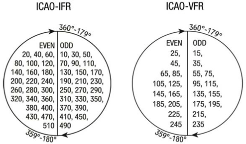
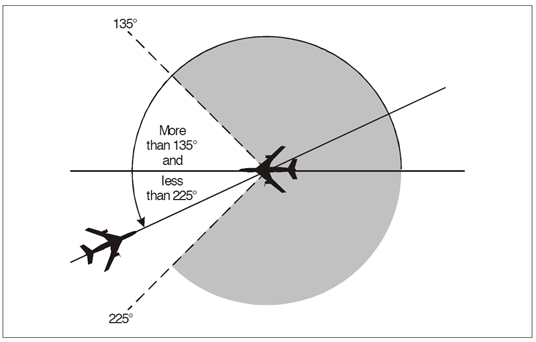
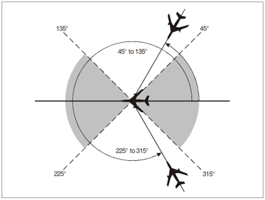
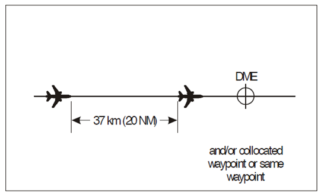
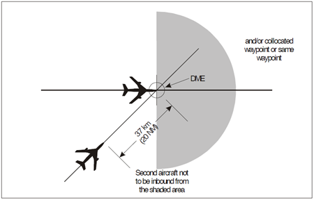

# 3. Separation Methods & Minima
Separation is required to ensure there is always a minimum distance between aircraft to minimise the risk of collision. This is provided by means of position reports, or by identification on radar. As the Arabian FIRs have complete radar coverage over the whole of its airspace, this will be the main type discussed. 

There are two main types of separation employed by ATC: vertical and horizontal separation. If at any time one type of separation between aircraft is below the prescribed minimum, the other type of separation must exist. For example, if the horizontal separation between aircraft is below minimum, vertical separation must exist.

Vertical and horizontal separation must be provided:

- Between all flights in Class A and B airspace
- Between all IFR flights in Class C, D, and E airspace
- Between IFR and VFR flights in Class C airspace
- Between IFR and special VFR flights

When issuing clearances, the controller must ensure that it would not reduce the separation between aircraft to below the required minima. In addition, if one type of separation minima cannot be maintained, then another type of separation must be applied between aircraft before any separation minima is infringed. 

## 3.1 Vertical separation
### 3.1.1 Vertical separation minima
Vertical separation is assured by assigning aircraft specific altitudes or flight levels in accordance with the altimeter setting procedures described in section 2.1. 

Unless subject to the conditions described below, aircraft flying below FL 290 must be separated by a minimum of 1000 ft. Above this level, aircraft must be separated by at least 2000 ft vertically.

### 3.1.2 Reduced vertical separation minima (RVSM)
Special instrument and equipment installation is required for an aircraft to be able to operate in RVSM airspace. Between FL 290 and FL 410, RVSM may be applied. Most modern turbine aircraft are equipped to operate in RVSM airspace.

Under RVSM, for aircraft flying below FL 410, the minimum vertical separation is 1000 ft. Above this level, a separation minima of 2000 ft is applied.

In Arabian airspace, RVSM applies.

### 3.1.3 Assignment of crusing levels
Aircraft will typically be assigned only one cruising level for an aircraft travelling beyond a controller’s control area. It is the responsibility of the next controller to issue further climb as appropriate.

ATC must also ensure that the cruising level is not below the published minimum en-route cruising level for a specified route or airway.

In general, aircraft already occupying a specified cruising level will have priority for that cruising level. For example, when two or more aircraft have requested the same cruising level, the preceding aircraft will normally have priority.

### 3.1.4 RVSM crusing levels
Cruising levels in RVSM airspace are assigned according to the semi-circular rule (Table 3-1). The semi-circular specifies cruising levels based on an aircraft’s planned magnetic track.

Additionally, any regional level restrictions must also be complied with in conjunction with the semi-circular rule.

<figure markdown>

</figure>
<figure markdown>
  <figcaption>Table 3-1: Semi-circular rule for aircraft cruising levels</figcaption>
</figure>

### 3.1.5 Vertical separation during climb or descent
During a climb or descent, aircraft may only be permitted to initiate a climb or descent to a level previously occupied by another aircraft after the latter has reported vacating that level.

The only exceptions to this rule apply when aircraft are encountering severe turbulence, or their performance is markedly different, such as a lightly loaded 777 following an A320. For these cases, the second aircraft may only be cleared to the level of the fist after it has passed a level separated by the specified minimum.

Consideration must also be given to the vertical speed of aircraft descending in a holding pattern, to ensure that the separation minima is not infringed at any point. If required, ATC should specify minimum or maximum descent rates.

## 3.2 Horizontal separation
### 3.2.1 Lateral separation
Lateral separation is applied so that the spanwise distance between two aircraft never reduces to below a specified minimum. This is ensured by operating aircraft on different routes at different locations, by visual observation, by, the use of navigational aids or by area navigation (RNAV).

### 3.2.2 Lateral separation criteria and minima
Lateral separation can be applied through the following methods:

- By reference to position reports which positively indicate aircraft geographical location, visually or by reference to a navigational aid
- By reference to VOR, NDB, or GNSS on intersecting tracks or ATS routes separated by a minimum appropriate to the navigational aid used (Table 3-2)
    - The distances given in the table are ground distances between aircraft.

| Angular difference between tracks measured at the common point (degrees) | 1000 ft to FL 190 Distance from common point | FL 200 to FL 600 Distance from common point |
|:------------------------------------------------------------------------:|:-----------------------------------------------:|:----------------------------------------------:|
|                                 15 to 135                                |                      15 NM                      |                      23 NM                     |

<figure markdown>
  <figcaption>Table 3-2: Lateral separation between two aircraft flying VOR or GNSS on crossing tracks</figcaption>
</figure>

<figure markdown>

</figure>
<figure markdown>
  <figcaption>Figure 3-1: Visual representation of lateral separation based on geographical position</figcaption>
</figure>

As Arabian airspace primarily relies on GNSS and the ATS route system is RNAV only, the separation minima with reference to a VOR or NDB will not be discussed.

### 3.2.3 Longitudinal separation
Longitudinal separation is applied so that the distance between two aircraft never reduces below a prescribed minimum on their longitudinal axis (nose to tail). Longitudinal separation will be applied for aircraft on the same or diverging tracks using speed control.

When applying time or distanced based longitudinal separation, controllers must exercise caution for aircraft with different speed characteristics. If a following aircraft maintains a higher speed than the preceding aircraft, speed control must be applied before aircraft are expected to reach minimum separation.

For separation purposes the terms “same track”, “reciprocal track”, and “crossing track” have the following meanings (Figure 3-2, 3-3, and 3-4):

<figure markdown>

</figure>
<figure markdown>
  <figcaption>Figure 3-2: Aircraft on the same track</figcaption>
</figure>

<figure markdown>

</figure>
<figure markdown>
  <figcaption>Figure 3-3: Aircraft on reciprocal tracks</figcaption>
</figure>

<figure markdown>

</figure>
<figure markdown>
  <figcaption>Figure 3-4: Aircraft on crossing tracks</figcaption>
</figure>

### 3.2.4 Longitudinal separation minima based on distance using GNSS or DME
Aircraft maintaining separation with reference to any combination of DME or on board GNSS systems (RNAV) must be in direct contact with ATC though VHF radio. 

The following minima applies for this type of separation.

#### 3.2.4.1 Aircraft at the same level
For aircraft at the same level, and following the same track (Figure 3-5) the longitudinal separation minima is 20 NM, provided each aircraft uses the following:

- The same “on track” DME
- An “on track” DME and a collocated waypoint where one aircraft is using DME and the other GNSS
- The same waypoint where both aircraft are using GNSS

Separation must be checked by obtaining constant GNSS based or DME based position data at frequent intervals. Aircraft that are ADS-B out capable will satisfy this requirement.

<figure markdown>

</figure>
<figure markdown>
  <figcaption>Figure 3-5: Longitudinal separation for aircraft at the same level on the same track using DME and/or collocated GNSS waypoint</figcaption>
</figure>

#### 3.2.4.2 Reduced longitudinal separation
For aircraft at the same level following the same track, the longitudinal separation minima may be reduced to 10 NM, provided the leading aircraft is travelling 20 knots faster or more (Figure 3-6).

The same conditions as 3.2.4.1 will also apply in order to use this reduced separation.

<figure markdown>

</figure>
<figure markdown>
  <figcaption>Figure 3-6: Reduced DME/GNSS based longitudinal separation for aircraft on the same track and at the same level</figcaption>
</figure>

#### 3.2.4.3 Aircraft on crossing tracks
For aircraft on crossing tracks where the relative angle between the tracks is less than 90 degrees, the aircraft shall be separated by a minimum of 20 NM provided each aircraft reports a distance based on DME/collocated GNSS waypoint (Figure 3-7).

A reduced separation minimum of 10 NM may also be applied if the leading aircraft is travelling 20 knots or faster or more (Figure 3-8).

The same conditions as 3.2.4.1 shall apply for both these cases.

<figure markdown>

</figure>
<figure markdown>
  <figcaption>Figure 3-7: DME/GNSS based separation for crossing traffic at the same level</figcaption>
</figure>

<figure markdown>

</figure>
<figure markdown>
  <figcaption>Figure 3-8: DME/GNSS based reduced separation for crossing traffic at the same level</figcaption>
</figure>

#### 3.2.4.4 Aircraft climbing or descending
The separation minima for aircraft climbing or descending through the level of another following the same track is 10 NM. 

In this case, one aircraft must maintain the same level when vertical separation does not exist (Figure 3-9, 3-10). 

The same conditions as 3.2.4.1 also apply.

<figure markdown>

</figure>
<figure markdown>
  <figcaption>Figure 3-9: DME/GNSS based longitudinal separation for aircraft climbing through the level of another on the same track</figcaption>
</figure>

<figure markdown>

</figure>
<figure markdown>
  <figcaption>Figure 3-10: DME/GNSS based longitudinal separation for aircraft descending through the level of another on the same track</figcaption>
</figure>