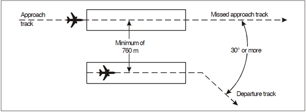

# 4. Separation in the Vicinity of Aerodromes
## 4.1 Procedures for departing aircraft
### 4.1.1 General
At aerodromes where standard instrument departures (SIDs) are established, departing aircraft should normally be cleared to follow an appropriate SID

If no specific procedures are established or aircraft are unable to comply with a SID, the direction of flight after take-off, the initially cleared level and any other necessary information should be passed to the aircraft.

### 4.1.2 Standard clearances for departing aircraft
Standard clearances for departing aircraft shall contain the following items:

- Aircraft identification;
- Clearance limit, normally the destination aerodrome;
- Designator of the assigned SID, if applicable;
- Cleared level;
- Allocated SSR code;
- Any other necessary instructions or information not contained in the SID description

### 4.1.3 Clearances on a SID
Where departing aircraft are expected to comply with all speed and altitude restrictions on the SID, the phrase `CLIMB VIA SID TO <cleared level>` shall be used by the controller.

When departing aircraft is cleared to proceed directly to a published waypoint on the SID, the speed and altitude restrictions associated with the bypassed waypoints are cancelled. All remaining speed and altitude restrictions remain applicable.

When a departing aircraft is vectored or cleared to a point that is not on the SID, all published speed and altitude restrictions on the SID are cancelled. If necessary, the controller shall: 

- Reiterate the cleared level
- Provide speed and altitude restrictions as necessary
- Notify the pilot if it is expected that the aircraft will subsequently be instructed to re-join the SID and the expected point where this will occur.

## 4.2 Procedures for arriving aircraft
### 4.2.1 General
At aerodromes where standard instrument arrivals (STARs) have been established, aircraft will normally be cleared to follow the appropriate STAR. The aircraft shall be advised of the type of approach and runway-in-use as early as possible.

After coordination with the approach controller, the first aircraft may be cleared for the approach by the area control centre controller.

An IFR flight shall not be cleared for an initial approach below the appropriate minimum altitude specified for the procedure unless.

- The pilot has reported passing an appropriate point as define by a navigation aid or as a waypoint; or 
- The pilot reports the aerodrome is and can be maintained in sight; or
- The aircraft is conducting a visual approach; or
- The controller has determined the aircraft’s position by the use of an ATS surveillance system and a lower minimum altitude has been established for that sector.

### 4.2.2 Standard clearances for arriving aircraft
Where standard clearances are in use for arriving aircraft, provided no terminal delay is expected, the area control centre may clear an aircraft to follow a STAR without prior coordination with the approach controller.

Provision shall always be made to inform the approach controller of the sequence of aircraft following the same STAR.

Standard clearances for arriving aircraft shall contain the following items:

- Aircraft identification;
- Designator of the assigned STAR if applicable;
- Runway-in-use except where part of the STAR description;
- Cleared level;
- Any other necessary instruction or information not contained in the STAR description

### 4.2.3 Clearances on a STAR
Where arriving aircraft are expected to comply with all published altitude and speed restrictions on a STAR, the phrase `DESCEND VIA STAR TO <cleared level>` should be used.

When arriving aircraft are cleared to proceed directly to a published waypoint on the STAR, the speed and altitude restrictions associated with the bypassed waypoints are cancelled. All remaining speed and altitude restrictions remain applicable.

When arriving aircraft are vectored or cleared to a point that is not on the STAR, all published speed and altitude restrictions on the STAR are cancelled. If necessary, the controller shall: 

-  Reiterate the cleared level; and
-  Provide speed and altitude restrictions as necessary; and
-  Notify the pilot if it is expected that the aircraft will be subsequently instructed to re-join the STAR and the expected point where this will occur.

### 4.2.4 Visual approach
An IFR aircraft may be cleared to execute a visual approach provided the pilot can maintain visual reference to the terrain and:

- The reported ceiling is at or above the level of the beginning of the relevant initial approach segment; and
- The pilot reports at the level of the beginning of the initial approach segment or at any time during the instrument approach procedure that with the prevailing meteorological conditions there is reasonable assurance that a visual approach and landing can be completed.

Subject to these conditions, clearance for an IFR aircraft to execute a visual approach may be requested by the pilot or initiated by the controller. In the latter case, the flight crew must agree to continue visually.

For successive visual approaches, separation shall be maintained between aircraft by the controller until the pilot of the second aircraft reports having the first aircraft in sight and is able to maintain own separation. Where both aircraft are HEAVY category aircraft or the preceding aircraft is of a heavier category, a caution of possible wake turbulence shall be provided if the distance between them is lower than the appropriate wake turbulence minimum.

### 4.2.5 Instrument approach
The approach controller shall specify the instrument approach procedure to be used by the arriving aircraft. A flight crew may request an alternative approach procedure and, if circumstances permit, should be cleared accordingly.

If visual reference is established before completion of the approach procedure, the entire procedure must be executed unless the aircraft requests and is cleared for a visual approach.

## 4.3 Holding
In the event of extended delays, aircraft should be advised of such delay, and be permitted to reduce speed in order to absorb some of the arrival delay.

When delay is expected the area control centre shall normally be responsible for clearing aircraft to the holding fix and for including holding instructions, expected approach time or onward clearance time as applicable.

In Arabian airspace, where arrival delay is expected to exceed 20 minutes, the area control centre should pass the expected onward clearance time to the pilot.

## 4.4 Operations on parallel runways
### 4.4.1 Departing aircraft
#### 4.4.1.1 Types of operation
Parallel runways may be used for independent instrument departures in the following modes:

- Both runways used exclusively for departures (independent departures); or
- One runway is used exclusively for departures while the other is used for a mixture of departures and arrivals (semi-mixed operations); or
- Both runways are used for mixed arrivals and departures (mixed operations)

#### 4.4.1.2 Requirements and procedures for independent parallel departures
Independent parallel IFR departures may be conducted on parallel runways provided:

- The minimum distance between runway centrelines is at least 760 m; and
- Departure tracks diverge by at least 15 degrees immediately after take-off; and
- A suitable surveillance system capable of identifying aircraft within 1 NM of the runway is available; and
- ATS operational procedures ensure that track separation is achieved.

### 4.4.2 Arriving Aircraft
#### 4.4.2.1 Types of operation
Parallel runways may be used for simultaneous instrument operations for:

- Independent parallel approaches; or
- Dependent parallel approaches; or
- Segregated parallel approaches

#### 4.4.2.2 Requirements and procedures for independent parallel approaches
Independent parallel approaches may be conducted provided that:

- The minimum distance between runway centrelines is 1035 metres and suitable ATS surveillance equipment is available such as SSR, MLAT or ADS-B; and
- Instrument landing system (ILS) approaches are being conducted on both runways; and
- The missed approach track for one approach diverges by at least 30 degrees from the missed approach track of the adjacent approach; and
- Aircraft are advised of the runway identification as early as possible; and
- Vectoring is used to intercept the final approach course; and
- A no transgression zone (NTZ) at least 610 metres wide equidistant between runway centrelines must exist and be clearly marked on the radar display; and
- Separate controllers monitor the approaches to each runway and ensure that where 1000 ft vertical separation is reduced, aircraft do not enter the NTZ and applicable longitudinal separation between aircraft on the same localiser course is maintained; and
- Transfer of control is initiated before the higher of the two aircraft has intercepted the glide slope.
- The approach controller has frequency override capability over aerodrome control

As early as possible when aircraft have established communications with the approach controller, aircraft must be informed that independent parallel approaches are in use. This may be done through an ATIS broadcast.

When vectoring to intercept the ILS localiser course, the final vector should allow the aircraft to intercept at an angle of not greater than 30 degrees and allow for at least 1.0 NM of straight and level flight before the localiser intercept. The vector should also enable the aircraft to fly straight and level for at least 2.0 NM after establishing on the localiser before establishing on the glide path.

A minimum of 1000 ft vertical separation or a minimum radar separation of 3.0 NM must be applied between aircraft on parallel approaches until they are established on the final approach course.

For aircraft on the same localiser course, a minimum separation of 3.0 NM shall be applied unless greater longitudinal separation is required for wake turbulence or other reasons.

When assigning the final heading to intercept the ILS localiser course, the runway shall be confirmed and the aircraft shall be advised of:

- Its position relative to a fix on the ILS localiser course; and
- The altitude to be maintained when established on the ILS localiser course until the glide slope intercept point is reached; and
- If required, clearance for the appropriate ILS approach.

When aircraft are observed to overshoot the turn-on or continue on a track that will penetrate the NTZ, aircraft shall be instructed to return immediately to the correct track.

When an aircraft is observed entering the NTZ, the aircraft on the adjacent ILS localiser course shall be immediately instructed to climb and turn to the assigned heading/altitude to avoid the deviating aircraft.

Flight path monitoring shall not be terminated until:

- Visual separation is applied, provided both controllers are advised wherever visual separation is applied;
- The aircraft has landed, or in the case of a missed approach, 1.0 NM from the departure end of the threshold.

#### 4.4.2.3 Suspension of independent parallel approaches
Independent parallel approaches shall be suspended to runways with centrelines that are spaced less than 1525 metres from each other under certain meteorological conditions such as wind shear, turbulence, crosswind, and thunderstorms, which may increase the instances of localiser deviations.

#### 4.4.2.4 Requirements and procedures for dependent parallel approaches
Dependent parallel approaches may be conducted provided:

- The runway centrelines are spaced by 915 metres; and
- Aircraft are vectored to intercept the final approach track; and
- Suitable SSR equipment is available; and
- ILS approaches are conducted on both runways; and
- Aircraft are advised that approaches are in use for both runways (this may be provided in the ATIS); and
- The missed approach track for one approach diverges by 30 degrees from the missed approach track of the adjacent approach; and
- Approach control has frequency override capability over aerodrome control.

A minimum vertical separation of 1000 ft or a minimum radar separation of 3.0 NM is is provided to aircraft during the turn-on to intercept the localiser course.

The minimum radar separation between aircraft established on the final approach course shall be:

- 3.0 NM for aircraft on the same localiser course unless increased longitudinal separation is required for wake turbulence; or
- 2.0 NM between aircraft established on adjacent localiser courses

#### 4.4.2.5 Requirements and procedures for segregated parallel operations
Segregated parallel operations (Figure 4-1) may be conducted on parallel runways:

- The runway centrelines are spaced by 760 metres
- The nominal departure track diverges by at least 30 degrees from the missed approach track of the parallel approach.

The minimum distance between parallel runway centre lines for segregated parallel operations may be decreased by 30 metres for each 150 metres the arrival runway is staggered toward the arriving aircraft, to a minimum of 300 metres (Figure 4-2).

The following types of approaches may be conducted in segregated parallel operations provided suitable surveillance radar and suitable ground services are available such as an ILS.

<figure markdown>

</figure>
<figure markdown>
  <figcaption>Figure 4-1: Segregated parallel operations</figcaption>
</figure>

<figure markdown>

</figure>
<figure markdown>
  <figcaption>Figure 4-2: Segregated parallel operations where runways are staggered</figcaption>
</figure>