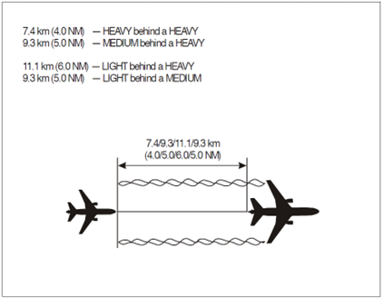

# 5. ATS Surveillance Services
## 5.1 General Procedures
### 5.1.1 Aircraft identification
For aircraft to be provided ATS surveillance services, aircraft identification must be established, and the pilot informed. Identification should then be maintained until the termination of ATS surveillance.

Identification on a secondary surveillance radar system (SSR) is established by one of the following methods:

- Recognition of the setting of a discrete transponder code (i.e. not ending in 00) 
- Observation of the IDENT feature of an aircraft transponder where a discrete transponder code has already been assigned.

Once radar identification has been established the pilot shall be informed. If at any time identification is lost or ATS surveillance service terminated, this pilot shall also be informed.

### 5.1.2 Position information
Where identification has been performed the aircraft should be informed of its position except in the following cases:

- Transfer of identification from one controller to another; or
- Assigned discrete SSR code identification and the aircraft’s position is consistent with its expected position based on its flight plan; or
- Based on the pilot’s report of position or within 1 NM of the departure runway and consistent with the planned departure time of the aircraft.

Position information shall be passed in the following forms:

- As a well-known geographical location; or
- As a magnetic track and distance from a significant point, en-route navigational aid or approach aid; or
- Direction (using points of a compass) from a known position; or
- Distance to touchdown if the aircraft is on final approach; or
- Distance and direction from the centreline of an ATS route.

Wherever practical, position information shall be made with reference to positions or routes relevant to the aircraft concerned.

## 5.2 Radar vectoring
Vectoring is achieved by assigning aircraft specific headings which will enable the aircraft to maintain the desired track.

When vectoring an aircraft, controllers should comply with the following:

- When an aircraft is given its initial vector diverting it from a previously assigned route, the pilot shall be informed of what the vector is to accomplish, and the limit of the vector should be specified (e.g. to position for approach).
- Controlled flights shall not be vectored into uncontrolled airspace except in case of emergency or to avoid adverse meteorological conditions, or on the specific request of the pilot.

When vectoring an IFR flight and when giving an IFR flight a direct routing which takes the aircraft off an ATS route, the controller should ensure that the minimum obstacle clearance exists at all times until the aircraft reaches a point where it is able to resume its own navigation.

When radar vectors are terminated, the controller shall issue an appropriate instruction to the aircraft to return it to its pre-planned route, and the aircraft should be instructed to resume own navigation.

## 5.3 Application of separation
Separation shall only be applied with reference to ATS surveillance systems if there is reasonable assurance that identification of aircraft will be obtained and maintained.

When the control of an identified aircraft will be transferred to a sector that applies procedural separation, or a higher separation minima, this separation must be applied before the aircraft enters the next sector, or the sector of airspace where the higher separation minima applies.

Under no circumstances should the symbols on the radar screen touch or overlap unless vertical separation is assured.

## 5.4 Separation minima based on ATS surveillance
### 5.4.1 SSR/ADS-B/MLAT based separation minima
When aircraft are under ATS surveillance either from SSR, ADS-B or MLAT, the minimum horizontal separation is 5.0 NM.

This may be reduced to 3.0 NM when radar and/or ADS-B and MLAT systems capabilities at a given location permit.

### 5.4.2 Separation minima on final approach
A minimum separation of 2.5 NM may be applied between aircraft under ATS surveillance when established on the final approach course within 10 NM of the runway threshold provided:

- The average runway occupancy of aircraft is not more than 50 seconds; and
- Braking action is reported as good and runway occupancy times are not adversely affected by contaminants such as slush, ice, and snow; and
- The aerodrome controller is able to observe visually or by means of surface movement radar or surface movement guidance and control (SMGCS), the runway in use and exit and entry taxiways; and
- Distance based wake turbulence minima do not apply; and
- Aircraft approach speeds are closely monitored by the controller and adjusted where necessary to ensure minimum separation; and
- Aircraft operators and pilots have been made fully aware of the need to exit the runway in an expeditious manner at the assigned exit taxiway

### 5.4.3 Separation from adjacent airspace
Except where transfer of control to be made, aircraft shall not be vectored closer than 2.5 NM to the boundary of the airspace that a controller is responsible for unless there has been prior coordination with the controller of the adjacent sector. This ensures that minimum horizontal separation will always exist between aircraft in different sectors.

### 5.4.4 Distance-based wake turbulence separation minima
The following distance-based wake turbulence separation minima shall by applied (Table 5-1) when aircraft are under ATS surveillance during the approach and departure phases of flight.

These minima shall be applied under the following circumstances:

- An aircraft is operating directly behind another at the same altitude or less than 1000 ft below; or
- Both aircraft are using the same runway, or a parallel runway separated by less than 760 metres; or
- An aircraft is crossing behind another aircraft at the same altitude or less than 1000 ft below

<table><thead>
  <tr>
    <th>Preceding Aircraft Category</th>
    <th>Succeeding Aircraft Category</th>
    <th>Separation Minima</th>
  </tr></thead>
<tbody>
  <tr>
    <td rowspan="3">SUPER</td>
    <td>HEAVY</td>
    <td>6 NM</td>
  </tr>
  <tr>
    <td>MEDIUM</td>
    <td>7 NM</td>
  </tr>
  <tr>
    <td>LIGHT </td>
    <td>8 NM</td>
  </tr>
  <tr>
    <td rowspan="3">HEAVY</td>
    <td>HEAVY</td>
    <td>4 NM</td>
  </tr>
  <tr>
    <td>MEDIUM</td>
    <td>5 NM</td>
  </tr>
  <tr>
    <td>LIGHT</td>
    <td>6 NM</td>
  </tr>
  <tr>
    <td>MEDIUM</td>
    <td>LIGHT</td>
    <td>5 NM</td>
  </tr>
</tbody>
</table>
<figure markdown>
  <figcaption>Table 5-1: Distance-based wake turbulence separation minima</figcaption>
</figure>

<figure markdown>

</figure>
<figure markdown>
  <figcaption>Figure 5-1: Aircraft operating directly behind</figcaption>
</figure>

<figure markdown>

</figure>
<figure markdown>
  <figcaption>Figure 5-2: Aircraft crossing behind</figcaption>
</figure>

### 5.4.5 Separation from aircraft that are holding
Where vertical separation does not exist between aircraft established in a holding pattern and aircraft not holding, a minimum of 5.0 NM of horizontal separation must exist. 

### 5.4.6 Separation of aircraft on reciprocal tracks
Where confirmation has been obtained from radar derived that aircraft on reciprocal tracks have passed, there is no requirement to ensure that minimum radar separation exists before reducing the minimum vertical separation provided:

- Both aircraft are properly identified; and
- Radar label leader lines for both tracks are not crossed; and
- The distance between the position symbols is increasing; and
- The position symbols are not touching or overlapping

### 5.4.7 Verification of Mode C altitude readout
Verification of pressure-altitude-derived level information (Mode C) displayed to the controller shall be effected by simultaneous comparison (reported and observed) at least once on initial contact by the first controller providing a surveillance service, when an aircraft enters civil controlled airspace after departure from an aerodrome within the Arabian FIRs or, on arrival/transit into civil controlled airspace within the Arabian FIRs. 

Following successful verification, the Mode C information may be considered to remain verified provided it is associated with a Mode A SSR Code that has been previously validated by another Arabian FIRs controller and that the observed Mode C information has an error of 200ft or less at all levels within the Arabian FIRs.

### 5.4.8 Determination of level occupancy
#### 5.4.8.1 Maintaining a level
An aircraft may be considered to be maintaining a level when the observed altitude readout is within the tolerances, of the assigned level, as laid down in 5.4.8.

#### 5.4.8.2 Vacating a level
An aircraft can be considered to have vacated a level during a climb or descent when the observed altitude readout is more than 200ft from the previously occupied level, in the anticipated direction.

#### 5.4.8.3 Passing a level
An aircraft may be considered to have crossed a level during a climb or descent when the observed altitude readout has passed the level by more than 200ft in the required direction. 

#### 5.4.8.4 Reaching a level
An aircraft may be considered to have reached a level to which it had been cleared when whichever is the greater of 3 sensor or display updates, or 15 seconds has passed since the level information has indicated that it is within the appropriate tolerance required in 5.4.8.

#### 5.4.8.5 Departing a runway
Aircraft may be considered to have departed a runway when the surveillance display indicates a positive rate of climb from the aerodrome elevation. However, Mode C information shall not be used when the display varies by more than 200ft from the aerodrome elevation during the take-off roll.