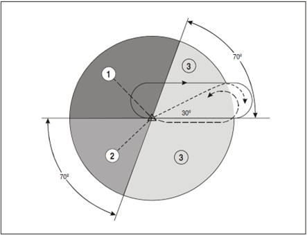

# 11. Holding
## 11.1 General
Holding is an instrument procedure employed by ATC as a delay tactic to manage the rate of traffic flow into a terminal area, to ensure that its capacity is not exceeded during peak arrival times, as well as times when traffic flow rate is constrained such as during low visibility or single-runway operations.

In the Arabian FIRs, holding is generally managed by area control, and aircraft are instructed to hold at fixes that are outside the respective terminal area. In exceptional cases, holding may be conducted within the terminal area at published holding fixes on the respective STAR.

During times of peak arrivals, a dedicated holding stack controller may sometimes be used to reduce frequency congestion, the workload of the area controller and allow more efficient level allocation and timely hold exits.

## 11.2 Hold capacity
All holding fixes have a maximum holding capacity that is determined by the minimum and maximum holding levels. When the hold’s maximum capacity is reached, i.e. aircraft are entering the hold at levels above the maximum holding level, aircraft shall be instructed to proceed to an alternative holding fix.

## 11.3 Hold management
### 11.3.1 Hold entry
Aircraft shall generally enter the hold via one of three entry procedures:

- Parallel entry (sector 1)
- Offset/teardrop entry (sector 2)
- Direct entry (sector 3)

<figure markdown>

</figure>
<figure markdown>
  <figcaption>Figure 11-1: Hold entry sectors</figcaption>
</figure>

Aircraft that have reported entering the hold may be considered established over the holding fix.

### 11.3.2 Descent clearance
When aircraft are instructed to descend in the hold, they shall only be cleared:

- To a level 1000 ft above traffic below that is maintaining level flight; or
- To a level vacated by traffic below if its mode C readout indicates a descent

### 11.3.3 Hold exit
Once aircraft are ready to be sequenced for the arrival, they should be instructed to exit the hold. There are three primary methods of instructing an aircraft to exit the hold, each with their own set of risks and benefits.

#### 11.3.3.1 Exit on completion of hold
This technique allows aircraft to be given the hold exit instruction in advance when radio traffic permits. However, this does not allow for an expeditious exit from the hold and may sometimes take up to 5 minutes to accomplish the hold instruction. This means that the exit must be planned for in advance, potentially increasing controller workload.

To accomplish this, aircraft must be instructed `ON COMPLETION, EXIT THE HOLD`.

#### 11.3.3.2 Exit with a direct
For an immediate exit, aircraft may be instructed to proceed directly to the holding fix from their present position. This allows for an exit from the hold requiring a maximum of 2 minutes to accomplish. However, this method is liable to error from a mis-programmed FMC.

In order to mitigate this risk, it is preferable to instruct the aircraft to proceed directly to the first fix on the STAR instead of the holding fix. This guarantees that the aircraft will not remain in the hold, as they will bypass the holding fix.

An additional advantage of this technique is that aircraft remain within the holding protected area under most circumstances.

#### 11.3.3.3 Vectored exit in combination with a direct
Vectors used in combination with instructions to proceed directly to a fix allow for an expeditious hold exit and has many advantages, as it allows the aircraft to be immediately taken out of the hold and establishes horizontal separation with holding traffic. This allows the holding traffic to be descended to a lower altitude provided that the exiting traffic is kept at minimum radar separation from holding traffic.

To accomplish this, aircraft are issued an appropriate vector to either extend the outbound heading, or to fly a heading that is perpendicular to the holding inbound course towards the non-holding side. A combination of both these headings may be used to exit multiple aircraft simultaneously.

Once aircraft have been vectored clear of holding traffic, they may be given a direct to either the holding fix or to the first fix on the STAR. Consideration shall be given to the risks discussed in 11.3.3.2.

For all holding fixes in the Arabian FIRs, the minimum holding level is above the highest minimum sector altitude and assures terrain and obstacle clearance. However, as with any other time when vectoring an aircraft, consideration shall be given to the minimum radar manoeuvring altitudes, as well as adjacent airspace.