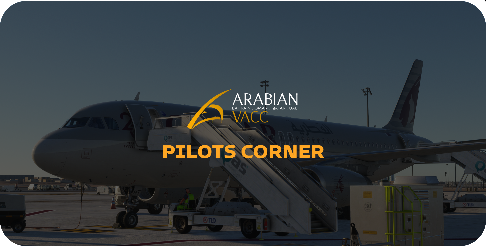

<figure markdown>

</figure>

## Scope
The following briefings provide an overview of the general operating procedures for our airports, designed for pilots flying in or out. These briefings complement the relevant aerodrome charts and should be used alongside them. If any discrepancies arise between the procedures in these briefings and the aerodrome charts, the procedures in these briefings take precedence.

## Limitation of Liability
!!! warning
    All documentation in this section is intended solely for use on the VATSIM network and must not be used for real-world aviation operations. The authors disclaim any liability for personal injury or death resulting from misuse of this material.

## Acknowledgements
!!! info
    This document includes excerpts and images from, and is primarily based on, ICAO Doc 4444 – PANS-ATM, along with the respective Civil Aviation Authority regulations and eAIP of each country.

