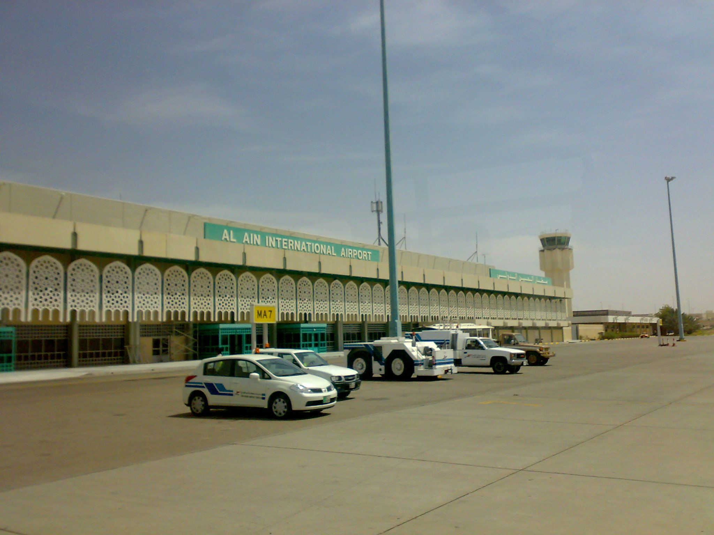

# Al-Ain
## Airport Overview
### Information

<figure markdown>

</figure>

| IATA | ICAO | Charts | NOTAM(s) |
|:----:|:----:|:------:|:----------:|
| AAN  | OMAL | [U.A.E eAIP (Account Required)](https://www.gcaa.gov.ae/en/ais/Pages/default.aspx)    | [U.A.E FIR - NOTAM(S) ](https://www.gcaa.gov.ae/en/ais/notice-to-airmen-notam)      |

Al Ain International Airport is located 8 nautical miles north-west of Al Ain in the Eastern Region of Abu Dhabi, United Arab Emirates. Opened on 31 March 1994, it ranks as the fifth busiest airport in the UAE.

### Charts & Scenery
Pilots can access the latest charts through the following sources: [Chartfox (Free, VATSIM login required)](https://chartfox.org/), [the U.A.E eAIP (Free, account required)](https://www.gcaa.gov.ae/en/ais/Pages/default.aspx), or [Navigraph (Subscription required)](https://navigraph.com/).

| Simulator      | Freeware                                                                                  | Payware                            |
|----------------|-------------------------------------------------------------------------------------------|------------------------------------|
| MSFS           | [flightsim.to](https://flightsim.to/file/75574/al-ain-international-airport-and-air-base) |                                    |
| X-Plane        | X-Plane Default                                                                           |                                    |
| Prepar3D V4/V5 |                                                                                           |                                    |