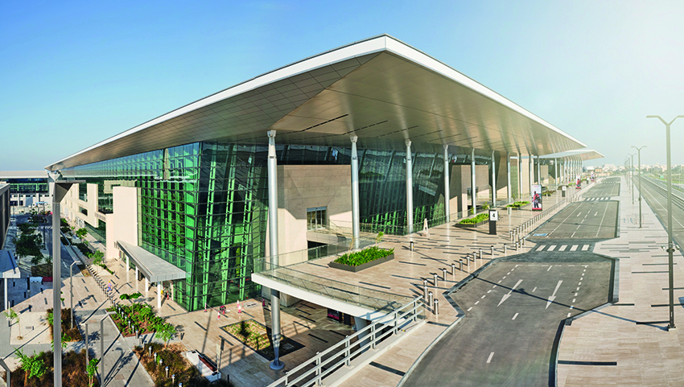

# OBBI - Bahrain
## Airport Overview
### Information

<figure markdown>

</figure>

| IATA | ICAO | Charts | NOTAM(s) |
|:----:|:----:|:------:|:----------:|
| BAH  | OBBI | [Bahrain eAIP](https://aim.mtt.gov.bh/eaip)    | |

Bahrain International Airport is the main international airport in Bahrain. Situated on Muharraq Island, near the capital city of Manama and the city of Al Muharraq, it serves as the hub for the national airline, Gulf Air. The airport is operated by the Bahrain Airport Company and was established in 1927, making it the oldest international airport in the Persian Gulf.

### Charts & Scenery
Pilots can access the latest charts through the following sources: [Chartfox (Free, VATSIM login required)](https://chartfox.org/), [Bahrain eAIP](https://aim.mtt.gov.bh/eaip), or [Navigraph (Subscription required)](https://navigraph.com/).

| Simulator      | Freeware                                                                                                           | Payware                            |
|----------------|--------------------------------------------------------------------------------------------------------------------|------------------------------------|
| MSFS           | [flightsim.to](https://flightsim.to/file/19077/bahrain-international-airport-obbi) | [MFSG](https://secure.simmarket.com/mfsg-bahrain-intl-obbi-msfs.phtml) |
| X-Plane        | X-Plane Default                                                                                                    | [JustAsia](https://secure.simmarket.com/justasia-bahrain-intl-airport-city-obbi-x-plane-11.phtml) |
| Prepar3D V4/V5 | | [MFSG](https://secure.simmarket.com/mfsg-bahrain-international-airport-obbi-2019-fsx-p3d-fs2004.phtml) |