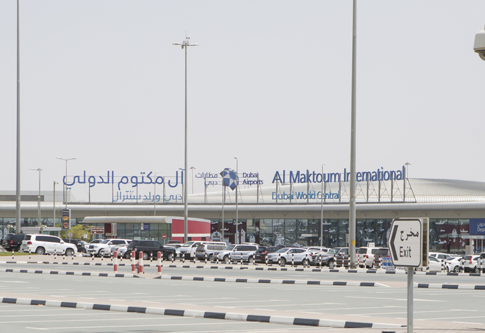

# Al-Maktoum
## Airport Overview
### Information

<figure markdown>

</figure>

| IATA | ICAO | Charts | NOTAM(s) |
|:----:|:----:|:------:|:----------:|
| DWC  | OMDW | [U.A.E eAIP (Account Required)](https://www.gcaa.gov.ae/en/ais/Pages/default.aspx)    | [U.A.E FIR - NOTAM(S) ](https://www.gcaa.gov.ae/en/ais/notice-to-airmen-notam)      |

Al Maktoum International Airport, also known as Dubai World Central, is an international airport located in Jebel Ali, 20 nautical miles southwest of Dubai, United Arab Emirates. Opened on 27 June 2010, it serves as the centerpiece of Dubai South, a planned area for residential, commercial, and logistics development.

Upon full completion (initially planned for 2027, now anticipated by 2030), the airport will integrate multiple transportation modes, logistics, and value-added services, such as manufacturing and assembly, within a single free economic zone. Al Maktoum International primarily supported freight operations, with limited passenger services offered by a few airlines.

### Charts & Scenery
Pilots can access the latest charts through the following sources: [Chartfox (Free, VATSIM login required)](https://chartfox.org/), [the U.A.E eAIP (Free, account required)](https://www.gcaa.gov.ae/en/ais/Pages/default.aspx), or [Navigraph (Subscription required)](https://navigraph.com/).

| Simulator      | Freeware                                                                                                           | Payware                            |
|----------------|--------------------------------------------------------------------------------------------------------------------|------------------------------------|
| MSFS           |                                                                                                                    |                                    |
| X-Plane        | X-Plane Default                                                                                                    |                                    |
| Prepar3D V4/V5 | [AVSIM](https://library.avsim.net/search.php?CatID=root&SearchTerm=omdw*.zip&Sort=Added&ScanMode=0&Go=Change+View) |                                    |